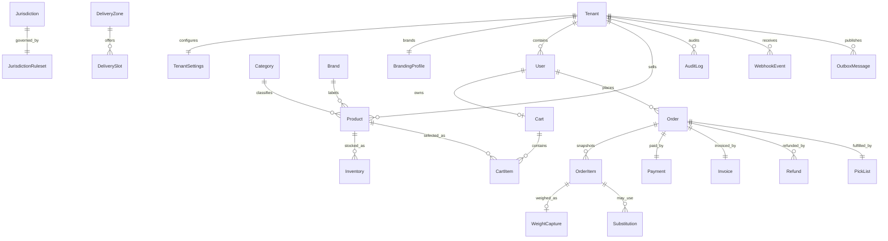

# Database

PostgreSQL 17 is the system of record. Prisma defines portable structure while the initial SQL migration owns PostgreSQL-specific partial indexes, trigram indexes, row-level security, and append-only triggers.

## Entity map

## Key tables and constraints

- `Tenant`, `TenantSettings`, `BrandingProfile`, and `CmsPage` hold deployment and white-label configuration.
- `User` and `Address` are tenant-scoped identities and delivery details.
- `Category`, `Brand`, `Product`, `ProductImage`, `Warehouse`, and `Inventory` form the catalogue. Monetary columns are `BigInt` minor units with an adjacent currency.
- `Cart` is deliberately singular. PostgreSQL partial unique indexes allow one active cart per user or guest token.
- `Order` snapshots authoritative totals and independent payment, fulfilment, refund, purchase-age, and delivery-age statuses.
- `OrderItem` snapshots product, price, tax, category, alcohol, age, variable-weight, unit-price, HFSS, and return-policy facts so edits never rewrite history.
- `Payment` and `Invoice` have unique `orderId`; provider payment intent identifiers are globally unique; order idempotency keys are unique within a tenant.
- `AgeVerification` stores an outcome and provider reference, never identity-document data.
- `AlcoholDayBookEntry` and `DriverManifest` carry immutable hashes for regulated exports.
- `WebhookEvent`, `OutboxMessage`, and `IdempotencyKey` make asynchronous boundaries durable and replay-safe.
- `AuditLog` is append-only through a database trigger and indexed for entity history.

Every tenant-scoped table has a `tenantId` index or a tenant-leading composite index. Row-level-security policies compare it with `app.current_tenant_id`, set by the request-scoped database boundary.

## Why there is no GroceryOrder table

Grocery and alcohol require different presentation, tax, fulfilment, compliance, and reporting treatment, but they are one commercial transaction. A mixed basket therefore creates one `Order`, one `Payment`, one payment intent, and one `Invoice`. `OrderItem.orderCategory`, `isAlcohol`, and restriction snapshots provide the required separation without splitting order count or customer experience.

## Migration operations

Use `pnpm db:migrate:deploy` for deployment and `pnpm db:reset` only in disposable development databases. The initial migration enables `pg_trgm`, creates the invariant indexes, enables RLS, and installs the audit-mutation trigger.
